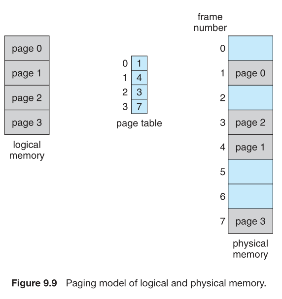
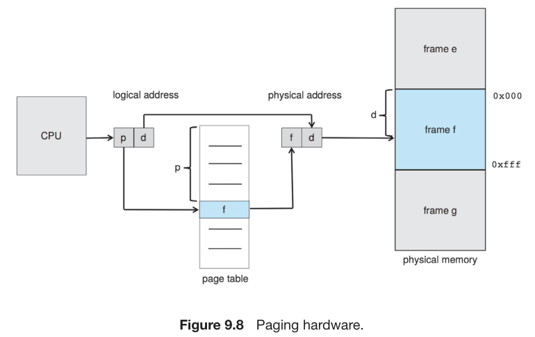
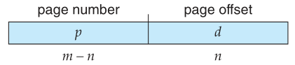

# Paging
## Basic method
* Implementing paging involves
    * breaking **logical memory** into blocks of the same size called **pages**
    * breaking **physical memory** into fixed-sized blocks called **frames**
* When a **process** is to be executed, it's **pages** are loaded into any available **memory frames** from their source(a **file system** or the **backing store**)   
    * The **backing store** is divided into **fixed-sized blocks** that are the **same size** as the **memory frames**
* Every **address** generated by the **CPU** is divided into two parts: a **page number** (p) and a **page offset** (d) 

    * The **page number** is used as an **index** into a **per-process page table**
    * The **page table** contains the **base address** of each **frame** in **physical memory**
    * The **page offset** is the location in the **frame** being referenced
    * The **base address** of the **frame** is combined with the **page offset** to define the **physical memory address**.
    
    
* The steps taken by the **MMU** to translate a **logical address** generated by the CPU to a **physical address**:
    1. Extract the **page number** *p* and use it as an **index** into the **page table**.
    2. Extract the corresponding **frame number** *f* from the **page table**.
    3. Replace the **page number** *p* in the **logical address** with the **frame number** *f*
    

* The **page size** (like the **frame size**) is defined by the hardware. 
    * The size of a page is a power of 2
        * It makes the translation of a **logical address** into a **page number** and **page offset** easy
        * If the size of the **logical address space** is 2^m, and a **page size** is 2^n bytes then:
            * The high-order **m-n** bits of a **logical address** designate the **page number**
            * The **n low-order** bits designate the **page offset**.

            

            * where **p** is an index into the page table and **d** is the displacement within the page
